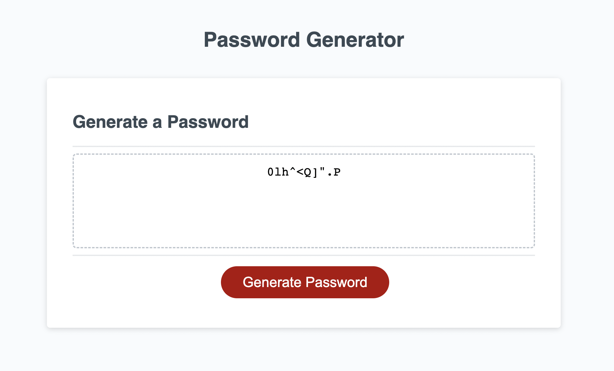

# Password Generator Homework Assignment

## Objective

The objective of this assignment was to create a password generator that interacts with the html in the index file. The password generator should first ask the client how many digits they would like, check for 8-128, then proceed to ask if they would like lowercase letters, uppercase letters, numbers, and special characters. For any of these that the client chooses, the password generator then does a random selection and provides a custom password to the client, based on their responses.

## What I Learned

First and foremost, I learned that I really really need to create my repo before starting the homework. What I actually did was start the homework and do a bunch of revisions as I tested it. I woke up on the day the homework was due with the realization that I hadn’t done any git commits yet, and then it dawned on me: I hadn’t created the repo. First thing this morning (Sunday 4/2/23), that’s what I tried to do. It took me most of the day and lots of frustration to figure it out. In the meantime I pretty much completed the homework assignment, with just a few tweaks needed. (It wasn't printing the password to the browser - turns out I had 2 lines of code in the wrong spot.)

As far as the assignment itself, I started with a whole lot of if/else statements. My code was super repetitive so I did meet with a tutor yesterday to go over the thought processes I needed to follow to break the steps down and simplify my code. After discussing with the tutor, I was able to cut my lines of code down to about 1/3 of what I had before. 

## Link to Production

## Screenshot

